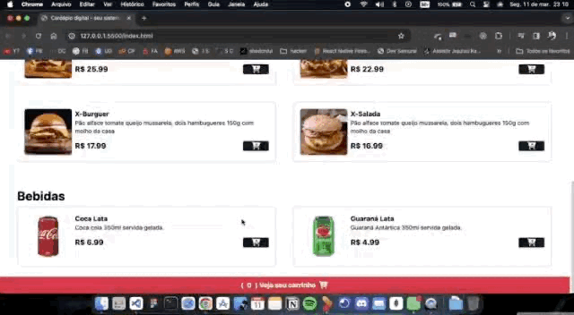

# :clipboard: Sobre o projeto

Este projéto fictício feito para simular uma hamburgueria com seu cardápio digital
onde é vinculado ao whatsApp para finalizar o pedido com os dados de entrega.

Abaixo podemos ver o resultado final do projeto. Espero que gostem!

 

   
  

# 🔗 Acesse o site com o link abaixo.

- [WillTech Hamburgueria - O melhor hamburguer da cidade ](https://willtechcod.github.io/Cardapio-Digital/_blank)

## :computer: Tecnologias utilizadas

Este projeto foi desenvolvido com as seguintes tecnologias:

- [JavaScript](https://www.javascript.com/)
- [HTML](https://developer.mozilla.org/pt-BR/docs/Web/HTML)
- [CSS](https://developer.mozilla.org/pt-BR/docs/Web/CSS)

